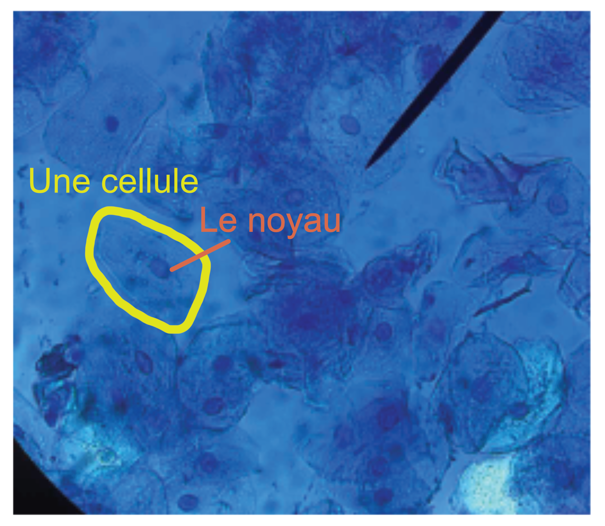
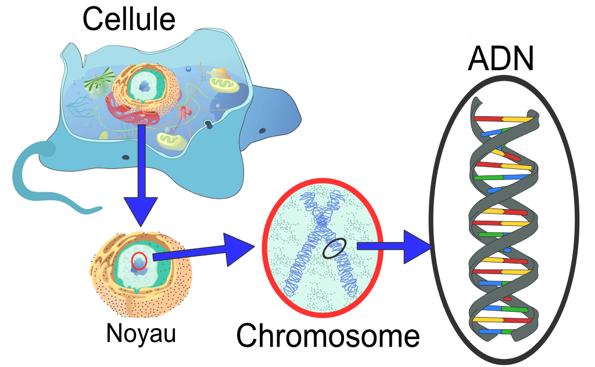
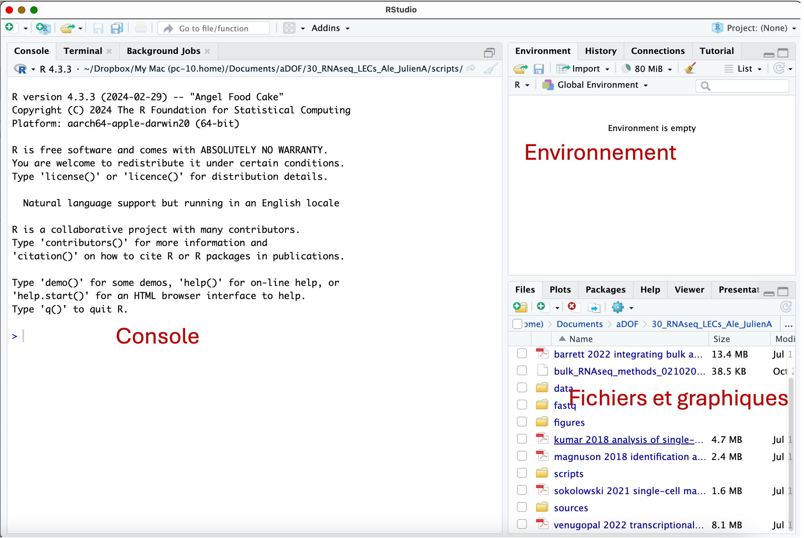
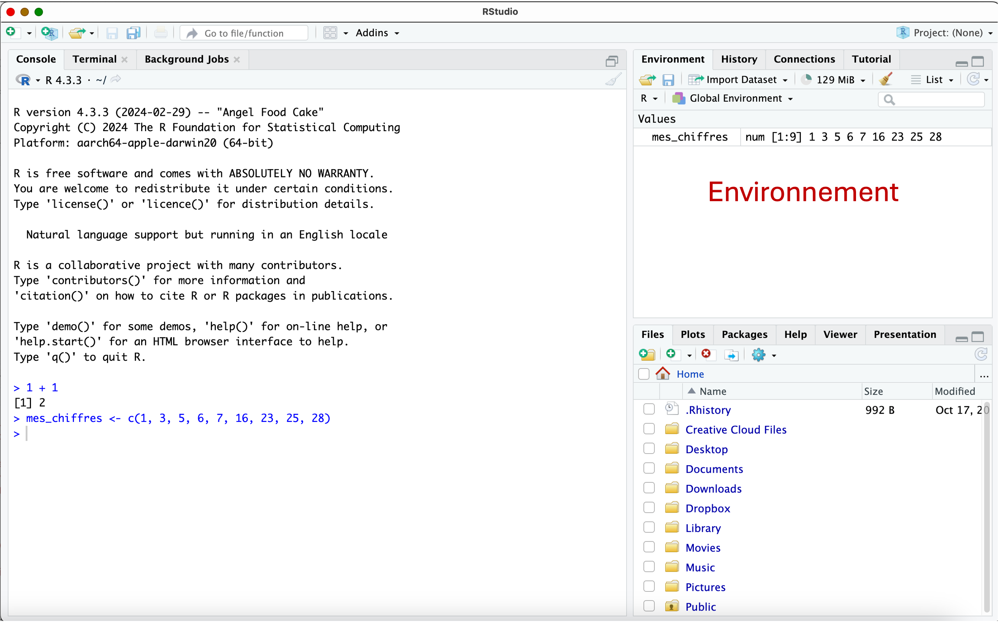

Introduction

## La biologie

Avant de nous plonger dans le monde de la bioinformatique, nous devons nous pencher sur la partie de la biologie qui est 
étudiée par la bioinformatique. En effet, la biologie est un sujet très vaste. Certains biologistes étudient le comportement
des animaux par exemple, d'autres étudient comment les plantes se défendent contre les herbivores,
alors que d'autres étudient les maladies humaines. 

Des biologistes à l'oeuvre:

<figure>
  
  <figcaption>Au laboratoire, dans la serre, dans la forêt, ou dans la mer!</figcaption>
</figure>


Aussi bien que la biologie est vaste, la bioinformatique l'est tout autant. Certains bioinformaticiens et
bioinformaticiennes étudient l'évolution des espèces animales, d'autres les mutations des virus (le virus qui cause 
la COVID, ça vous rappelle
quelque chose?), ou encore aident à développer des nouveaux médicaments.

La bioinformatique étudie très souvent l'ADN et le génome des organismes vivants. Mais c'est quoi l'**ADN** ?
Et c'est quoi un **génome** ?

### L'ADN et le génome

Imaginons que nous observons notre peau, par exemple, avec les yeux nus. Nous pouvons voir des petites crevasses, peut-être 
la peau sèche, ou des grains de beauté. Si nous regardions notre peau avec un microscope, nous pourrions voir encore plus!
Nous pourrions voir que notre peau est composée de [**cellules**](https://fr.wikipedia.org/wiki/Cellule_(biologie)), que nous ne voyons pas à l'oeil nu. 
Les cellules, ce sont les plus petites entités de notre corps, qui se regroupent pour former des organes et le corps des organismes vivants.
Et pas seulement les êtres humains! Les animaux, les champignons, les plantes et même les bactéries, sont
composés de cellules!

Voici une image de cellules extraites de l'intérieur de la bouche. 

<figure>
  
</figure>

Comme vous pouvez voir sur l'image de la cellule, la zone ronde et un peu plus foncée dans chaque cellule
est le [**noyau**](https://fr.wikipedia.org/wiki/Noyau_(biologie). Le noyau contient le secret de fabrication et de fonctionnement d'une cellule, et donc de notre corps.
A l'intérieur du noyau, on trouve une molécule appelée [**ADN**](https://fr.wikipedia.org/wiki/Acide_d%C3%A9soxyribonucl%C3%A9ique) (abbréviation de Acide DésoxyriboNucléique).
L'ADN peut être imaginé comme une longue chaîne qui s'enroule, et protégée à l'intérieur du noyau. Les maillons 
qui composent la chaîne d'ADN sont de 4 sortes. Il n'est pas important de connaître leurs noms exacts, mais
on utilise une abréviation pour les décrire: A, T, C et G. Ces quatre molécules, aussi appelées **bases**, 
s'attachent bout à bout et s'associent en paires pour former
une hélice. L'ADN qui se trouve dans chaque noyau de nos cellules et donc organisé en forme d'hélice. Puis, 
l'hélice est enroulée sous forme de [**chromosomes**](https://fr.wikipedia.org/wiki/Chromosome!

<figure>
  
</figure>

La chaîne d'ADN que les humains ont dans chacune de leurs cellules est très longue. Combien pensez-vous qu'il 
y a de paires d'A, T, C et G par noyau de cellule humaine? 

??? done "Réponse"
  	Dans chaque noyau de cellule humaine, il y a [3.2 milliards](https://fr.wikipedia.org/wiki/G%C3%A9nome_humain) de paires d'A, T, C et G 
  	qui composent notre ADN! La chaîne d'ADN est divisée
  	en 46 chromosomes (23 paires) par cellule. 
  	En comparaison, l'ADN de la bactérie [_Bacillus subtilis_](https://fr.wikipedia.org/wiki/Bacillus_subtilis), que l'on trouve dans
  	le sol, contient 4,2 millions de paires de bases. La plante de [blé](https://fr.wikipedia.org/wiki/Bl%C3%A9_tendre)
  	contient environ 15 milliards de paires de bases. Finalement, la 
  	plante [_Paris japonica_](https://fr.wikipedia.org/wiki/Paris_japonica) contient environ 150 milliards de paires de bases.
  	
  	Pour d'autres chiffres intéressants, voir la [Database of useful biological numbers](https://bionumbers.hms.harvard.edu/bionumber.aspx?s=n&v=7&id=105448)
 
 
 Nous pouvons imaginer l'ADN comme un livre: le texte du livre est composé d'une longue
 suite d'A, T, C et G. Le livre est organisé en chapitres, ce qui correspond aux chromosomes. Et à l'intérieur de chaque
 chromosome, nous avons des pages individuelles, ce qui correspond aux [**gènes**](https://fr.wikipedia.org/wiki/G%C3%A8ne).
 
 Un gène est donc un segment d'ADN qui contient une information particulière importante
 au fonctionnement des cellules ou à la définition du corps. 
 L'ensemble de l'ADN et des gènes d'une espèce est appelé le [**génome**](https://fr.wikipedia.org/wiki/G%C3%A9nome).
 Un exemple de gène pourrait être les gènes qui détermine la couleur des poils des chats.
 Un autre exemple est le gène qui permet de produire l'hémoglobine dans les globules
 rouges du sang. 

Combien y'a t'il de gènes dans le génome humain? 

??? done "Réponse"
  	Chez l'humain, il y a environ [20'000 gènes](https://fr.wikipedia.org/wiki/G%C3%A9nome_humain).
  	En comparaison, la bactérie [_Bacillus subtilis_](https://fr.wikipedia.org/wiki/Bacillus_subtilis), que l'on trouve dans
  	le sol, contient 4'100 gènes. Le génome de la plante de [blé](https://fr.wikipedia.org/wiki/Bl%C3%A9_tendre)
  	contient environ 95'000 gènes.
  	
### L'expression des gènes

Comme nous l'avons dit plus haut, un gène est un segment d'ADN qui contient une information particulière importante 
au fonctionnement des cellules ou à la définition du corps. Les gènes se trouvent sur l'ADN
a l'intérieur du noyau, mais leur information doit généralement pouvoir sortir
du noyau pour pouvoir jouer leur rôle. L'ADN ne sort jamais du noyau! Ce qui va sortir,
c'est une copie des gènes, une molécule appelée [ARN](https://fr.wikipedia.org/wiki/Acide_ribonucl%C3%A9ique)!
L'ARN est similaire à l'ADN, mais il n'a pas
de structure en hélice, et contient des séquences des bases A, U, C et G au lieu de A, T, C et G comme
dans l'ADN. On peut imaginer l'ARN comme étant une photocopie d'un gène, comme 
une photocopie d'une page d'un livre qui ne peut pas sortir de la bibliothèque.
Si la cellule a besoin de beaucoup de l'information contenue dans le gène, elle
va créer beaucoup de copies, donc beaucoup de molécules d'ARN de ce gène. 
Si la cellule a besoin de peu de l'information de ce gène, elle ne va pas en faire
de copie, et donc on ne trouvera pas d'ARN de ce gène dans la cellule.

<figure>
  
</figure>

Le phénomène de la création des copies des gènes en ARN s'appelle donc [**l'expression
des gènes**](https://fr.wikipedia.org/wiki/Expression_g%C3%A9nique). Au laboratoire, 
à l'aide de machines, il est possible de mesurer 
précisément le nombre de copies d'ARN de chaque gène présentes dans une cellule
ou un échantillon. 

## La bioinformatique

Lorsque nous voulons étudier l'ADN ou l'ARN, nous avons besoin d'une machine qui permet de 
nous donner la séquence des bases A, T/U, C et G de l'ADN ou de l'ARN dans un échantillon. La première étape
est généralement d'extraire l'ADN ou l'ARN des cellules au laboratoire pour obtenir
uniquement l'ADN ou l'ARN voulu. La séquence des bases dans l'échantillon 
est ensuite lue par une machine appelée un **séquenceur**. 

<figure>
  
  <figcaption>Cette machine est un séquenceur, le Genome Analyzer, exposé au Naturéum de Lausanne lors de l'exposition Spécimen 24</figcaption>
</figure>

Un séquenceur génére beaucoup de données! En effet, il va nous donner toute la liste
des bases dans notre échantillon, pour les milliers de gènes du génome.
Et si l'ADN ou l'ARN est séquencé pour plusieurs échantillons,
ça nous donne encore plus de données! 

Cela signifie que nous ne pouvons pas analyzer les données à la main. **Il nous 
faut des ordinateurs et des programmes informatiques pour lire et comprendre 
toutes ces données. C'est donc le travail du/de la bioinformaticien/ne!**

<!--
Voici des exemples de données générées en bioinformatique:   
*    
*  Trouver les mutations dans une tumeur.  
-->

### Un outil utilisé en bioinformatique : R - exploration

R est un outil de programmation originalement utilisé pour faire des analyses statistiques. R s'est 
révélé être un outil très utile également pour la bioinformatique.  
Apprendre R (ou la programmation en général), c'est comme apprendre une langue. Si
vous voulez apprendre le suédois, il faudra apprendre le vocabulaire, la grammaire, et 
beaucoup s'exercer.
Si vous voulez apprendre à programmer, il faudra apprendre le vocabulaire du langage
de programmation et sa syntaxe, et beaucoup s'exercer!

[R](https://cran.r-project.org/) et [RStudio](https://posit.co/download/rstudio-desktop/) peuvent être installés gratuitement.
Une fois les deux programmes installés,
seul RStudio devra être ouvert (il se connecte automatiquement à R).

Trois fenêtres s'ouvrent par défaut dans RStudio. L'une des fenêtres correspond
à la **console**. C'est la console que nous allons utiliser pour donner
des instructions de tâches à réaliser par R.

<figure>
  
</figure>

R peut être utilisé simplement comme une calculatrice. Tapez le texte ci-dessous
dans la partie **console**, juste après le petit signe **<span style="color:blue">></span>**,
puis pressez la touche **Enter** sur votre clavier: 

```r
1 + 1
```

La réponse au calcul donnée dans la console indique que 1 + 1 = 2 (Bravo R!)

Evidemment, l'idée c'est d'utiliser R pour des tâches un peu plus complexe. 
Essayons de lui faire calculer une somme. On peut combiner plusieurs chiffres
et nombres, et les "enregister" dans R en utilisant un nom suivi du signe **<span style="color:blue"><-</span>**. 

Tapez la ligne ci-dessous dans la console, puis presser la touche Enter:

```r

mes_chiffres <- c(1, 3, 5, 6, 7, 16, 23, 25, 28)

```

La console ne donne pas de réponse, mais dans la fenêtre **Environnement**,
l'élément "mes_chiffres" apparaît. Il a été enregistré dans R grâce à l'utilisation
du signe **<span style="color:blue"><-</span>**. 

<figure>
  
</figure>

Nous allons maintenant donner l'instruction à R de faire la somme de tous les
nombres enregistrés dans l'élément "mes_chiffres". R contient des instructions pré-définies
que nous pouvons utiliser. Une somme de plusieurs chiffres se fait de la manière suivante,
toujours en tapant dans la console suivi de Enter (sum = somme en anglais):

```r

sum(mes_chiffres)

```

Nous savons maintenant que 1 + 3 + 5 + 6 + 7 + 16 + 23 + 25 + 28 = 114. Merci R!

### Scripts

Avec ce petit exercice de somme, on peut vite voir l'avantage de R. Si par exemple nous avons
fait une erreur dans la liste de chiffres et que en fait nous voulions inclure 24 au lieu de 
23, nous pourrions facilement corriger l'élément `mes_chiffres` et refaire la somme.

Avant de faire ceci, nous allons créé un fichier script. Un fichier script
nous permet d'écrire toutes les instructions que nous voulons donner à R, et de les 
enregistrer, pour facilement les modifier, ou pour nous souvenir dans quelques mois des
instructions que nous avons utilisées aujourd'hui.

Pour créer un fichier script, nous allons à **File > New File > R script**.

Ceci crée une 4e fenêtre:

<figure>
  
</figure>

Maintenant que nous avons créé un script, nous allons écrire toutes les instructions
dans le script au lieu de la Console, comme ça nous pouvons les enregister par la
suite ou facilement les modifier.

Le fichier script peut être facilement enregistré en cliquant sur le petit icône de
disquette en haut à gauche du script, ou sur **File > Save As...**.

Nous allons donc modifier les chiffres que nous avons dans `mes_chiffres`et re-calculer 
la somme correcte. Ecrivez le texte ci-dessous dans le fichier script. Afin d'indiquer
à R d'exécuter la somme depuis le fichier script, nous cliquons dans la ligne qui contient
les instructions, et cliquons sur le bouton "Run" qui se trouve en haut de la fenêtre script.
Ceci va envoyer l'instruction dans la console:

```r

mes_chiffres <- c(1, 3, 5, 6, 7, 16, 24, 25, 28)
sum(mes_chiffres)

```

Il faut cliquer sur "Run" pour chaque ligne qui se trouve dans le fichier script:

<figure>
  
</figure>

Après avoir remplacé 23 par 24, la nouvelle somme est 115! Vous pouvez jouer et changer,
enlever ou ajouter des chiffres en éditant directement dans le fichier script, et 
recalculer simplement la somme en utilisant l'instruction `sum` sur votre élément
`mes_chiffres`. 

### Mon premier programme avec R: "Bonjour la planète!"

Nous allons créer un petit programme qui montre que R peut être utilisé pour des
tâches répétitives. 

Taper ce texte dans le fichier script que vous avez créé, et envoyez chaque ligne à la
console R avec le bouton "Run". Vous pouvez remplacer le prénom Tania par votre
propre prénom par exemple:

```r
texte <- "Bonjour la planète! Moi, c'est Tania"

print(texte)

```

Ce que nous avons fait, c'est de créer l'élement `texte` qui contient un texte, et de
donner l'instruction à R d'imprimer le texte contenu dans l'élément `texte` avec la
fonction `print`. 

Nous pouvons créer ce que nous appelons une **boucle**. Ceci nous permet de 
répéter les salutations pour plusieurs prénoms, contenu dans un nouvel élément
appelé `prenom`:

```r

prenom <- c("Tania", "Marguerite", "Rose", "Celia")

for (i in 1:length(prenom)) {
print( paste0("Bonjour la planète! Moi, c'est ", prenom[i]))
}

```

Avec l'instruction `for`, nous demandons à R de parcourir les éléments qui se trouvent
dans `prenom` un à un, de concaténer "Bonjour la planète! Moi c'est " avec chaque 
élément de `prenom` avec l'instruction `paste0`, puis d'imprimer le résultat sur la console
avec l'instruction `print`. Le résultat:

```
[1] "Bonjour la planète! Moi, c'est Tania"
[1] "Bonjour la planète! Moi, c'est Marguerite"
[1] "Bonjour la planète! Moi, c'est Rose"
[1] "Bonjour la planète! Moi, c'est Celia"

```

### Chercher une séquence de bases d'ADN dans un gène

Finalement, comme nous utilisons R en bioinformatique, nous allons voir comment 
demander à R de chercher une séquence de bases d'ADN dans une plus longue suite.

Nous créons l'élément `mon_gene` qui contient les bases d'un gène par exemple, et
nous voulons savoir si une séquence plus courte de 3 bases contenues dans 
l'élément `a_chercher` sont aussi présentes dans `mon_gene`. Pour ce faire,
nous utilisons l'instruction `grep` qui permet de chercher des bases parmi
d'autres:

```r
mon_gene <- "ATTCGGTATCCTAGTCATCG"

a_chercher <- "TAT"

grep(a_chercher, mon_gene)

```

Si la console indique `1`, les bases dans `a_chercher` sont présentes dans `mon_gene`.
Si la console indique `integer(0)`, les bases dans `a_chercher` ne sont pas
présentes dans `mon_gene`.

Libre à vous de changer les bases dans `a_chercher` et de voir si elles sont présentes 
ou pas dans `mon_gene`!

## Les chats ont la gingivite!

Nous allons faire de la bioinformatique avec R pour explorer l'expression
des gènes dans des échantillons de gencives de chats ! 
 

<figure>
  
</figure>

Il arrive que les chats souffrent de gingivite chronique. Cette maladie
rend leurs gencives douleureuses, et les empêche de manger ou boire correctement.
Malheureusement, les chats affecté de gingivite chronique doivent prendre des médicaments
à vie, qui ne fonctionnent pas toujours.
Des [chercheurs](https://www.nature.com/articles/s41598-023-40679-4#Abs1) ont recolté des échantillons 
de gencives de chats malades de gingivite chronique, mais aussi
de chats en bonne santé, ou de gingivite légère et passagère. Ils ont comparé comment les gènes dans les gencives 
malades chroniquement changent comparé aux gencives saines ou légèrement malades.
Le but est de trouver de nouveaux traitements.

Une biologiste de laboratoire a extrait l'ARN des échantillons, et a fait mesurer la
quantité d'ARN de chaque gène avec un [séquenceur](#la-bioinformatique). Nous allons donc travailler avec
une table qui donne la mesure de chaque gène pour chaque échantillon. La table peut être 
téléchargée ci-dessous. Enregistrez la sur votre ordinateur au même endroit 
où le fichier script que vous avez créé plus haut a été enregistré :

[Télécharger la table](assets/data/genes_gingivite_chats.csv){: .md-button }

Pour importer la table et la garder en mémoire dans R, nous allons utiliser
l'instruction `read.csv` précédé du symbole `<-`. Avec l'instruction `head`, 
nous allons explorer la structure de notre table: chaque ligne correspond à un
gène, et chaque colonne correspond à un échantillon de chat.
Les chiffres nous donnent la quantité de chaque gène dans chaque gencive, c'est
à dire, l'expression, le nombre de copie d'ARN par gène.

```r
genes_chat <- read.csv("genes_gingivite_chats.csv", row.names = 1)

head(genes_chat)

```

Nous avons les informations d'expression pour des centaines de gènes. Nous pourrions
regarder chaque gène un par un, et voir comment il change parmi les maladies. Mais
cela nous prendrait beaucoup de temps. Avec des centaines ou milliers de gènes mesurés,
nous avons besoin d'un moyen de résumer cette information par échantillon. C'est ce
que nous allons faire avec la prochaine analyse. 
En effet, il est possible de regrouper les 
échantillons entre eux selon leur similarité d'expression des gènes. **Cette analyse s'appelle une
figure de PCA**.

Nous avons besoin de plusieurs instructions dans R. La première, `prcomp`, utilisée avec notre
table de gènes `genes_chat`, est
celle qui va faire l'analyse de PCA. Ensuite, nous allons créer la figure de PCA avec
l'instruction `ggplot`. Avec le paramètre `colour`, nous indiquons que les échantillons
dans notre figure de PCA doivent être colorés selon les 3 maladies. 

Voici les étapes nécessaires dans R:

```r
pca <- prcomp(t(genes_chat), scale. = TRUE, center = TRUE)$x
pca <- as.data.frame(pca)

pca$condition<-sapply(strsplit(colnames(genes_chat), "_"), '[', 2)

ggplot(pca, aes(x=PC1, y=PC2, colour = condition)) +
  geom_point() +
  geom_text_repel(label=rownames(pca))
```

<figure>
  
  <figcaption>Cette figure s'appelle une PCA</figcaption>
</figure>

Sur cette figure, chaque point représente un échantillon de gencive. **Les points se placent
de telle sorte que ceux qui ont une expression des gènes similaire soient plus proches les uns des
autres**. Les points sont colorés selon leur maladie: sain, gingivite légère, ou gingivite
chronique.

Que remarquez-vous donc? Comment sont regroupés les échantillons?

??? done "Réponse"
  	On remarque que les échantillons qui viennent d'une même maladie sont regroupés
  	dans la figure. Ceci peut nous indiquer que la gingivite
  	est peut-être causée par des gènes qui ont des nombres de copies différents comparé à 
  	la gencive saine. Il y a des différences d'expression des gènes
  	entre la gencive saine et les deux types de gingivite. 

Une bioinformaticienne a fait une analyse plus détaillée des gènes qui
changent entre la gingivite chronique et la gencive saine. Dans un génome, chaque gène
a un numéro unique. Par exemple, le gène *ENSFCAG00000013269* a une 
fonction dans le système immunitaire. La bioinformaticienne nous a donc transmis
une liste de gènes qui changent dans la gingivite chronique comparé à la gencive saine.

Nous allons garder en mémoire la liste de ces gènes avec le symbole `<-`. 

```r
genes <- c("ENSFCAG00000005637", "ENSFCAG00000045399", "ENSFCAG00000009165",
         "ENSFCAG00000013829", "ENSFCAG00000013269" ,
         "ENSFCAG00000015193", "ENSFCAG00000036851", "ENSFCAG00000009900",
         "ENSFCAG00000041420", "ENSFCAG00000041248")
```

Ces gènes sont-ils plus hauts ou plus bas dans la gingivite chronique? Nous allons
explorer cette question avec une figure appelée **heatmap** ou **carte de couleurs**.

Pour cela, nous devons extraire ces gènes de la table complète `genes_chat`, en utilisant les
symboles `[` et `]`. Puis, nous utilisons l'instruction `heatmap` qui va créer une carte 
de couleurs pour chaque gène dans chaque échantillon. 

```r

diff_genes <- genes_chat[genes,]    

heatmap(as.matrix(diff_genes), cexCol = 0.6, cexRow = 0.8)

```

Les paramètres `cexCol` et `cexRow` nous servent simplement à ajuster la taille
du texte des colonnes et des lignes, respectivement, dans la figure. La voici:

<figure>
  
  <figcaption>Cette figure s'appelle une "heatmap" ou carte de couleurs</figcaption>
</figure>

Dans notre carte de couleurs, nous avons un gène par ligne et 
un échantillon de gencive par colonne. Nous voyons dans le nom de chaque 
colonne de quelle maladie vient l'échantillon. L'intensité des couleurs nous indique
l'expression de chaque gène dans chaque échantillon. Plus la couleur est foncée et rouge,
plus le gène est présent dans l'échantillon. Avec cette carte de couleurs, nous 
pouvons voir que certains gènes sont plus hauts dans la gingivite chronique, alors
que certains gènes sont plus hauts dans la gencive saine. Que ce passe t'il avec 
ces gènes dans la gingivite légère?

??? done "Réponse"
  	Les gènes qui sont hauts dans la gingivite chronique semble lègèrement moins
  	hauts dans la gingivite légère, mais quand même plus haut que dans la gencive
  	saine. En plus, les gènes qui sont hauts dans la gencive saine sont bas dans la 
  	gingivite légère, comme dans la gingivite chronique. Il semble que ces gènes ont
  	des quantités plus similaires à la gingivite chronique, et différent de la gencive 
  	saine.
  	
Maintenant, le travail du biologiste avec lequel ou laquelle la bioinformaticienne
collabore c'est de comprendre le rôle de ces gènes, et de voir si on peut donner un
médicament qui va cibler ces gènes et guérir les chats malades. Par exemple, le gène
*ENSFCAG00000013269* a un rôle dans le système immunitaire. Il est plus haut chez les chats 
avec la gingivite chronique. Est-ce que le système immunitaire est dérèglé chez ces chats?
Peut-être est-ce la raison de leur maladie.

Il est possible de jouer avec les couleurs de la carte. Essayez de changer les couleurs
en utilisant un des paramètres suivants dans l'instruction `heatmap`:    

* `terrain.colors(50)`.  
* `rainbow(50)`.  
* `heat.colors(50)`.  
* `topo.colors(50)`.   

* `cm.colors(50)`.   

Par exemple, utilisons les couleurs de l'arc-en-ciel:

```r

heatmap(as.matrix(diff_genes), col=rainbow(50), cexCol=0.8, cexRow = 0.5)

```

<figure>
  
  <figcaption>Cette carte a des couleurs arc-en-ciel!</figcaption>
</figure>


<!--Photo dent chat:
https://unsplash.com/photos/white-and-brown-cat-with-green-scarf-td3PkgUCQmc

Chat faché:
https://unsplash.com/photos/brown-tabby-cat-on-green-grass-during-daytime-u-xClTcaVFk
Chat langue:
https://unsplash.com/photos/brown-tabby-cat-on-white-textile-NvXmO9z30Oo
-->

### Mon chat a't-il la gingivite ?

Voici **Cappuccino**, mon chat. Il a l'air fâché. Souffre-t'il de gingivite?

<figure>
  
  <figcaption>Cappuccino</figcaption>
</figure>

Afin de déterminer si mon chat a la gingivite, nous avons fait extraire l'ARN d'un petit
morceau de sa gencive, et quantifié ses gènes au séquenceur. Nous avons
de nouveau reçu une table avec la quantité de chaque gène dans son échantillon.

[Télécharger la table des gènes de Cappuccino](assets/data/chat20_cappuccino_genes.csv){: .md-button }

Une façon de déterminer si la gencive de Cappuccino est malade, c'est de comparer
l'expression de ses gènes à celle de la gencive saine, de la gingivite légère et
de la gingivite chronique. Rappelez-vous qu'avec la figure de PCA, il est possible
de regrouper les échantillons selon leur similarité d'expression de gènes. Nous allons
donc créer une figure de PCA qui contient tous les échantillons, rajouter l'échantillon
de Cappuccino, et comparer où se place Cappuccino par rapport aux échantillons sains ou 
malades. 

La première étape est d'importer la table des gènes de Cappuccino avec l'instruction 
`read.csv`, et de l'unir à la 
table des gènes de tous les autres chats avec l'instruction `cbind`:

```r
cappuccino <- read.csv("chat20_cappuccino_genes.csv", row.names = 1)

genes_avec_cappuccino <- cbind(genes_chat, cappuccino)

```

Et maintenant, nous allons créer la même figure de PCA que précédemment :

```r
pca <- prcomp(t(genes_avec_cappuccino), scale. = TRUE, center = TRUE)$x
pca <- as.data.frame(pca)

pca$condition <- sapply(strsplit(colnames(genes_avec_cappuccino), "_"), '[', 2)

ggplot(pca, aes(x=PC1, y=PC2, colour = condition)) +
  geom_point(size=2) +
  geom_text_repel(label=rownames(pca))
```

Où dans la figure se place l'échantillon de Cappuccino? 
Mon chat a t'il une gencive malade?

??? done "Réponse"
    <figure>
      
    </figure>
  	L'échantillon de Cappuccino se place parmi les échantillons de gingivite 
  	chronique. Ceci indique que les gènes dans sa gencive sont présentes en quantité
  	malade. Le vétérinaire va préscrire des médicaments à Cappuccino, espérons qu'ils
  	fonctionnent!


<!--Est-ce que les cellules de poumons de chat, tigre et canard peuvent être infecté par COVID?
https://www.nature.com/articles/s41467-021-27162-2
Cat and tiger yes, duck no. ACE2
-->

<!--
Photo de chat: 
https://unsplash.com/photos/tan-and-black-tabby-kitten-_AHEpAdR8Xo

https://unsplash.com/photos/silver-tabby-kitten-on-floor-7AIDE8PrvA0
-->

## Le but final - la publication scientifique

Une fois des découvertes faites et un projet de recherche accompli, on le publie dans 
un article scientifique, couramment écrit en anglais. Un article permet
à toute la communauté scientifique de découvrir les résultats de la recherche,
et permet de générer de nouvelles idées et projets de recherche afin
d'améliorer par exemple les traitments contre les maladies. L'article sur l'expression
des gènes dans la gingivite des chats est disponible 
[en ligne](https://www.nature.com/articles/s41598-023-40679-4#Abs1).

<figure>
  
  <figcaption>Vue de l'article scientifique sur la gingivite des chats</figcaption>
</figure>

En plus du texte, les articles scientifiques contiennent des figures qui permettent
de partager les découvertes avec les lecteurs. Les figures doivent permettre
de faire comprendre le message et les découvertes décrites.

Le/la bioinformaticien/ne dédie du temps à créer des figures pour les inclure dans les
articles scientifiques. Nous en avons vu
des exemples: la figure de PCA et la carte de couleurs ! 

D'autres exemples de figures:

<figure>
  
</figure>

<figure>
  
</figure>

<figure>
  
</figure>

<figure>
  
  <figcaption>Oh, c'est ce que la souris a peint en page d'accueil de ce site !</figcaption>
</figure>


## Compétences nécessaires pour devenir bioinformaticien ou bioinformaticienne:

Un/e bioinformaticien/ne a besoin de plusieurs compétences:

* Aisance avec les ordinateurs et l'informatique.    
* Connaissance de la biologie fondamentale.
* Aisance avec les mathématiques.    
* Volonté de se former continuellement et d'apprendre régulièrement de nouvelles choses.  
* Un goût pour créer des figures.  
* Un goût pour le travail collaboratif, car un/e bioinformaticien/ne doit interagir
avec les personnes qui génèrent les données au laboratoire, et les directeurs de recherche
qui interprètent les données et écrivent les articles.   
* Patience lorsque les programmes informatiques ne fonctionnent pas du premier coup ;-).  

Enfin, l'inconvénient du métier, c'est le fait de travailler assis devant un ordinateur,
ça manque un peu de mouvement.

**Merci d'avoir lu jusqu'au bout !**

