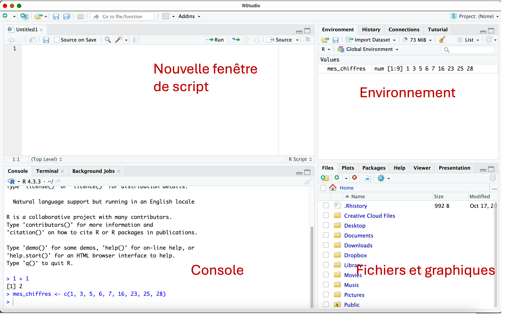

## Introduction - Biologie

Avant de nous plonger dans le monde de la bioinformatique, nous devons nous pencher sur la partie de la biologie qui est 
étudiée par la bioinformatique. En effet, la biologie est un sujet très vaste. Certains biologistes étudient le comportement
des animaux par exemple, d'autres étudient comment les plantes se défendent contre les herbivores,
alors que d'autres étudient les maladies humaines. 

Des biologistes à l'oeuvre:

<figure>
  
  <figcaption>Au laboratoire, dans la serre, dans la forêt, ou dans la mer!</figcaption>
</figure>


Aussi bien que la biologie est vaste, la bioinformatique l'est tout autant. Certains bioinformaticiens et
bioinformaticiennes étudient l'évolution des espèces animales, d'autres les mutations des virus (le virus qui cause 
la COVID, ça vous rappelle
quelque chose?), ou encore développent de nouveaux médicaments.

La bioinformatique étudie très souvent l'ADN et le génome des organismes vivants. Mais c'est quoi l'**ADN** ??
Et c'est quoi un **génome** ??

## L'ADN et le génome

Imaginons que nous observons notre peau, par exemple, avec les yeux nus. Nous pouvons voir des petites crevasses, peut-être 
la peau sèche, ou des grains de beauté. Si nous regardions notre peau avec un microscope, nous pourrions voir encore plus!
Nous pourrions voir que notre peau est composée de [**cellules**](https://fr.wikipedia.org/wiki/Cellule_(biologie)), que nous ne voyons pas à l'oeil nu. 
Les cellules, ce sont les plus petites entités de notre corps, qui se regroupent pour former des organes et le corps des organismes vivants.
Et pas seulement les êtres humains! Les animaux, les champignons, les plantes et même les bactéries, sont
composés de cellules!

Voici une image de cellules extraites de l'intérieur de la bouche. 

<figure>
  
</figure>

Comme vous pouvez voir sur l'image de la cellule, la zone ronde et un peu plus foncée dans chaque cellule
est le **noyau**. Le noyau contient le secret de fabrication et de fonctionnement d'une cellule, et donc de notre corps.
A l'intérieur du noyau, on trouve une molécule appelée [**ADN**](https://fr.wikipedia.org/wiki/Acide_d%C3%A9soxyribonucl%C3%A9ique) (abbréviation de Acide DésoxyriboNucléique).
L'ADN peut être imaginé comme une longue chaîne qui s'enroule, et protégée à l'intérieur du noyau. Les maillons 
qui composent la chaîne d'ADN sont de 4 sortes. Il n'est pas important de connaître leurs noms exacts, mais
on utilise une abréviation pour les décrire: A, T, C et G. Ces quatre molécules, aussi appelées **bases**, 
s'attachent bout à bout et s'associent en paires pour former
une hélice. L'ADN qui se trouve dans chaque noyau de nos cellules et donc organisé en forme d'hélice. Puis, 
l'hélice est enroulée sous forme de **chromosomes**!

<figure>
  
</figure>

La chaîne d'ADN que les humains ont dans chacune de leurs cellules est très longue. Combien pensez-vous qu'il 
y a de paires d'A, T, C et G par noyau de cellule humaine? 

??? done "Réponse"
  	Dans chaque noyau de cellule humaine, il y a [3.2 milliards](https://fr.wikipedia.org/wiki/G%C3%A9nome_humain) de paires d'A, T, C et G 
  	qui composent notre ADN! La chaîne d'ADN est divisée
  	en 46 chromosomes (23 paires) par cellule. 
  	En comparaison, l'ADN de la bactérie [_Bacillus subtilis_](https://fr.wikipedia.org/wiki/Bacillus_subtilis), que l'on trouve dans
  	le sol, contient 4,2 millions de paires de bases. La plante de [blé](https://fr.wikipedia.org/wiki/Bl%C3%A9_tendre)
  	contient environ 15 milliards de paires de bases. Finalement, la 
  	plante [_Paris japonica_](https://fr.wikipedia.org/wiki/Paris_japonica) contient environ 150 milliards de paires de bases.
  	
  	Pour d'autres chiffres intéressants, voir la [Database of useful biological numbers](https://bionumbers.hms.harvard.edu/bionumber.aspx?s=n&v=7&id=105448)
 
 
 Nous pouvons imaginer l'ADN comme un livre: le texte du livre est composé d'une longue
 suite d'A, T, C et G. Le livre est organisé en chapitres, ce qui correspond aux chromosomes. Et à l'intérieur de chaque
 chromosome, nous avons des phrases, ce qui correspond aux **gènes**.
 
 Un gène est donc un segment d'ADN qui contient une information particulière importante
 au fonctionnement des cellules. L'ensemble de l'ADN et des gènes d'une espèce est appelé le **génome**.
 Un exemple de gène pourrait être le gène qui détermine la couleur des poils des chats par exemple.
 

Combien y'a t'il de gènes dans le génome humain? 

??? done "Réponse"
  	Chez l'humain, il y a environ [20'000 gènes](https://fr.wikipedia.org/wiki/G%C3%A9nome_humain).
  	En comparaison, la bactérie [_Bacillus subtilis_](https://fr.wikipedia.org/wiki/Bacillus_subtilis), que l'on trouve dans
  	le sol, contient 4'100 gènes. Le génome de la plante de [blé](https://fr.wikipedia.org/wiki/Bl%C3%A9_tendre)
  	contient environ environ 95'000 gènes.
  	

--> To do: L'ADN contient notre code génétique. 
L'ADN ne doit jamais sortir du noyau. Mais alors, comment fait la cellule pour lire et utiliser l'information gardée dans 
l'ADN?
Explication gènes: combien de gène chez les humains? Qu'est ce que l'expression d'un gène?

Image livre de recettes, bibliothèque copie (RNA)
Comment mesurer l'expression des gènes?


Image du plus petit au plus grand: corps, cellules chromosome ADN

Le génome, c'est donc l'ensemble de l'ADN et des gènes d'une espèce!


Exemple couleurs des chats.
->


## La bioinformatique

Machine qui lit l'ADN et l'ARN: beaucoup de données (eg pour des milliers de gènes) pour 
beaucoup d'échantillons. Il nous faut des ordinateurs et des programmes informatiques pour lire et comprendre toutes ces données!
On n'arriverait pas à le faire à la main!
photo genome analyzer riponne

-> Todo: compléter. Exemple de données générées en bioinformatique: 
*    
*  Trouver les mutations dans une tumeur.  

## Un outil utilisé en bioinformatique : R - exploration

R est un outil de programmation originalement utilisé pour faire des analyses statistiques. R s'est 
révélé être un outil très utile également pour la bioinformatique.  
Apprendre R (ou la programmation en général), c'est comme apprendre une langue. Si
vous voulez apprendre le suédois, il faudra apprendre le vocabulaire, la grammaire, et 
beaucoup s'exercer.
Si vous voulez apprendre à programmer, il faudra apprendre le vocabulaire du langage
de programmation et sa syntaxe, et beaucoup s'exercer!

[R](https://cran.r-project.org/) et [RStudio](https://posit.co/download/rstudio-desktop/) peuvent être installés gratuitements. Une fois les deux programmes installés,
seul RStudio devra être ouvert (il se connecte automatiquement à R).

Trois fenêtres s'ouvrent par défaut dans RStudio. L'une des fenêtres correspond
à la **console**. C'est la console que nous allons utiliser pour donner
des instructions de tâches à réaliser par R.

<figure>
  
</figure>

R peut être utilisé simplement comme une calculatrice. Tapez le texte ci-dessous
dans la partie **console**, juste après le petit signe **<span style="color:blue">></span>**,
puis pressez la touche **Enter** sur votre clavier: 

```r
1 + 1
```

La réponse au calcul donnée dans la console indique que 1 + 1 = 2 (Bravo R!)

Evidemment, l'idée c'est d'utiliser R pour des tâches un peu plus complexe. 
Essayons de lui faire calculer une somme. On peut combiner plusieurs chiffres
et nombres, et les "enregister" dans R en utilisant un nom suivi du signe **<span style="color:blue"><-</span>**. 

Tapez la ligne ci-dessous dans la console, puis presser la touche Enter:

```r

mes_chiffres <- c(1, 3, 5, 6, 7, 16, 23, 25, 28)

```

La console ne donne pas de réponse, mais dans la fenêtre **Environnement**,
l'élément "mes_chiffres" apparaît. Il a été enregistré dans R grâce à l'utilisation
du signe **<span style="color:blue"><-</span>**. 

<figure>
  
</figure>

Nous allons maintenant donner l'instruction à R de faire la somme de tous les
nombres enregistrés dans l'élément "mes_chiffres". R contient des instructions pré-définies
que nous pouvons utiliser. Une somme de plusieurs chiffres se fait de la manière suivante,
toujours en tapant dans la console suivi de Enter (sum = somme en anglais):

```r

sum(mes_chiffres)

```

Nous savons maintenant que 1 + 3 + 5 + 6 + 7 + 16 + 23 + 25 + 28 = 114. Merci R!

### Scripts

Avec ce petit exercice de somme, on peut vite voir l'avantage de R. Si par exemple nous avons
fait une erreur dans la liste de chiffres et que en fait nous voulions inclure 24 au lieu de 
23, nous pourrions facilement corriger l'élément `mes_chiffres` et refaire la somme.

Avant de faire ceci, nous allons créé un fichier script. Un fichier script
nous permet d'écrire toutes les instructions que nous voulons donner à R, et de les 
enregistrer, pour facilement les modifier, ou pour nous souvenir dans quelques mois des
instructions que nous avons utilisées aujourd'hui.

Pour créer un fichier script, nous allons à **File > New File > R script**.

Ceci crée une 4e fenêtre:

<figure>
  
</figure>

Maintenant que nous avons créé un script, nous allons écrire toutes les instructions
dans le script au lieu de la Console, comme ça nous pouvons les enregister par la
suite ou facilement les modifier.

Nous allons donc modifier les chiffres que nous avons dans `mes_chiffres`et re-calculer 
la somme correcte. Ecrivez le texte ci-dessous dans le fichier script. Afin d'indiquer
à R d'exécuter la somme depuis le fichier script, nous cliquons dans la ligne qui contient
les instructions, et cliquons sur le bouton "Run" qui se trouve en haut de la fenêtre script.
Ceci va envoyer l'instruction dans la console:

```r

mes_chiffres <- c(1, 3, 5, 6, 7, 16, 24, 25, 28)
sum(mes_chiffres)

```

Il faut cliquer sur "Run" pour chaque ligne qui se trouve dans le fichier script:

<figure>
  
</figure>

Après avoir remplacé 23 par 24, la nouvelle somme est 115! Vous pouvez jouer et changer,
enlever ou ajouter des chiffres en éditant directement dans le fichier script, et 
recalculer simplement la somme en utilisant l'instruction `sum` sur votre élément
`mes_chiffres`. 

### Mon premier programme avec R: "Bonjour la planète!"

Nous allons créer un petit programme qui montre que R peut être utilisé pour des
tâches répétitives. 

Taper ce texte dans le fichier script que vous avez créé, et envoyez chaque ligne à la
console R avec le bouton "Run". Vous pouvez remplacer le prénom Tania par votre
propre prénom par exemple:

```r
texte <- "Bonjour la planète! Moi, c'est Tania"

print(texte)

```

Ce que nous avons fait, c'est de créer l'élement `texte` qui contient un texte, et de
donner l'instruction à R d'imprimer le texte contenu dans l'élément `texte` avec la
fonction `print`. 

Nous pouvons créer ce que nous appelons une **boucle**. Ceci nous permet de 
répéter les salutations pour plusieurs prénoms, contenu dans un nouvel élément
appelé `prenom`:

```r

prenom <- c("Tania", "Marguerite", "Rose", "Celia")

for (i in 1:length(prenom)) {
print( paste0("Bonjour la planète! Moi, c'est ", prenom[i]))
}

```

Avec l'instruction `for`, nous demandons à R de parcourir les éléments qui se trouvent
dans `prenom` un à un, de concaténer "Bonjour la planète! Moi c'est " avec chaque 
élément de `prenom` avec l'instruction `paste0`, puis d'imprimer le résultat sur la console
avec l'instruction `print`. Le résultat:

```
[1] "Bonjour la planète! Moi, c'est Tania"
[1] "Bonjour la planète! Moi, c'est Marguerite"
[1] "Bonjour la planète! Moi, c'est Rose"
[1] "Bonjour la planète! Moi, c'est Celia"

```

### Chercher une séquence de bases d'ADN dans un gène

Finalement, comme nous utilisons R en bioinformatique, nous allons voir comment 
demander à R de chercher une séquence de bases d'ADN dans une plus longue suite.

Nous créons l'élément `mon_gene` qui contient les bases d'un gène par exemple, et
nous voulons savoir si une séquence plus courte de 3 bases contenues dans 
l'élément `a_chercher` sont aussi présentes dans `mon_gene`. Pour ce faire,
nous utilisons l'instruction `grep` qui permet de chercher des bases parmi
d'autres:

```r
mon_gene <- "ATTCGGTATCCTAGTCATCG"

a_chercher <- "TAT"

grep(a_chercher, mon_gene)

```

Si la console indique `1`, les bases dans `a_chercher` sont présentes dans `mon_gene`.
Si la console indique `integer(0)`, les bases dans `a_chercher` ne sont pas
présentes dans `mon_gene`.

Libre à vous de changer les bases dans `a_chercher` et de voir si elles sont présentes 
ou pas dans `mon_gene`!

## Les chats ont la gingivite!

Nous allons utiliser R pour explorer des gènes chez les chats.

Photo dent chat:
https://unsplash.com/photos/white-and-brown-cat-with-green-scarf-td3PkgUCQmc

Chat faché:
https://unsplash.com/photos/brown-tabby-cat-on-green-grass-during-daytime-u-xClTcaVFk
Chat langue:
https://unsplash.com/photos/brown-tabby-cat-on-white-textile-NvXmO9z30Oo

Explorer table: trouver un gène, est il haut chez mon chat?


Trouver quelle maladie a mon chat
PCA: qu'est ce que c'est, comment l'utiliser.
Avec des milliers de gènes mesurés, on a besoin d'un moyen de résumé/visualiser 

Trouver quels gènes changent par maladie
heatmap:

Changer les couleurs

Est-ce que les cellules de poumons de chat, tigre et canard peuvent être infecté par COVID?
https://www.nature.com/articles/s41467-021-27162-2
Cat and tiger yes, duck no. ACE2
Capuccino mon chat a-t il la gingivite?


Photo de chat: 
https://unsplash.com/photos/tan-and-black-tabby-kitten-_AHEpAdR8Xo

https://unsplash.com/photos/silver-tabby-kitten-on-floor-7AIDE8PrvA0


## Le but final - la publication scientifique

Une fois des découvertes faites et un projet de recherche acompli, on le publie.
Les publications/articles de journaux contiennent des figures/graphiques qui permettent
de partager les découvertes avec les lecteurs. Les graphiques doivent permettre
de faire comprendre le message et les découvertes décrites.

-> Todo: Screen-shot of scientifique paper, link to article of cats.

La bioinformaticienne dédie du temps à créer des figures/graphiques. Nous en avons vu
des exemples: figures de PCA et de heatmap. 

-> Eg circos plot, fancy barcode plot, cell-cell comm, UMAP of BECs used by painting mouse.

## Compétences nécessaires pour devenir bioinformaticien ou bioinformaticienne:

Un/e bioinformaticien/ne a besoin de plusieurs compétences:

* Aisance avec les ordinateurs et l'informatiques.    
* Connaissance de la biologie fondamentale.
* Aisance avec les mathématiques.    
* Volonté de se former continuellement et d'apprendre de nouvelles choses.  
* Un goût pour créer des figures et graphiques.  
* Un goût pour le travail collaboratif, car un/e bioinformaticien/ne doit interagir
avec les personnes qui génèrent les données au laboratoire, et les directeurs de recherche
qui interprète les données et écrivent les articles.   
* Patience lorsque les programmes informatiques ne fonctionnent pas du premier coup ;-).  


**Merci d'avoir lu jusqu'au bout !**


<!--
## Feedback
-->


